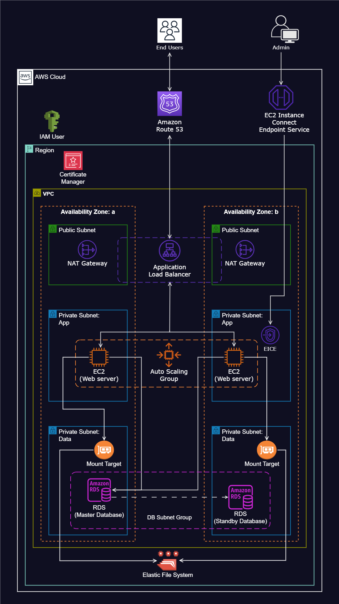

# Hosting a WordPress Website on AWS

## Overview
This project demonstrates how to deploy a **WordPress website** on **AWS**, leveraging various AWS services to ensure scalability, security, fault tolerance, and high availability. The infrastructure is automated using scripts available in this repository.

## Architecture
The architecture is designed with a **highly available** and **secure** infrastructure, featuring:
- **Multi-AZ deployment** for redundancy
- **Private & public subnets** for enhanced security
- **Auto Scaling** and **Load Balancing** for high availability
- **Managed services** such as **RDS, EFS, and Route 53**

## AWS Resources Utilized

1. **Virtual Private Cloud (VPC)**: Configured with public and private subnets across two Availability Zones for network isolation and security.  
2. **Internet Gateway**: Facilitates connectivity between VPC instances and the Internet.  
3. **Security Groups**: Implemented as firewalls to control inbound and outbound traffic.  
4. **Multi-AZ Setup**: Enhances reliability and fault tolerance by leveraging two Availability Zones.  
5. **Public Subnets**: Used for infrastructure components like the **NAT Gateway** and **Application Load Balancer**.  
6. **EC2 Instance Connect Endpoint**: Ensures secure access to instances in both public and private subnets.  
7. **Web Servers in Private Subnets**: Hosts EC2 instances in private subnets for enhanced security.  
8. **NAT Gateway**: Enables instances in private subnets to access the Internet for updates and patches.  
9. **WordPress Deployment on EC2 Instances**: The web application is hosted on EC2 instances.  
10. **Application Load Balancer (ALB) & Target Group**: Ensures high availability and evenly distributes traffic across an **Auto Scaling Group**.  
11. **Auto Scaling Group (ASG)**: Automatically adjusts EC2 instances based on traffic demand, ensuring scalability, fault tolerance, and elasticity.  
12. **GitHub for Version Control**: Stores web files and deployment scripts for collaboration.  
13. **AWS Certificate Manager**: Secures application communications with SSL/TLS certificates.  
14. **Simple Notification Service (SNS)**: Sends notifications about events within the Auto Scaling Group.  
15. **Route 53 for DNS Management**: Handles domain registration and DNS records for website accessibility.  
16. **Elastic File System (EFS)**: Provides a shared file system for web servers.  
17. **Relational Database Service (RDS)**: Manages the database for WordPress, ensuring high availability and backups.  

## Deployment Steps

### 1. Connect to Your EC2 Instance
```bash
ssh -i your-key.pem ec2-user@your-ec2-instance-ip
```

### 2. Update System Packages
```bash
sudo yum update -y
```

### 3. Install Apache Web Server
```bash
sudo yum install -y httpd
sudo systemctl enable httpd
sudo systemctl start httpd
```

### 4. Install PHP 8 & Required Extensions
```bash
sudo dnf install -y \
php \
php-cli \
php-cgi \
php-curl \
php-mbstring \
php-gd \
php-mysqlnd \
php-gettext \
php-json \
php-xml \
php-fpm \
php-intl \
php-zip \
php-bcmath \
php-ctype \
php-fileinfo \
php-openssl \
php-pdo \
php-tokenizer
```

### 5. Install MySQL Server
```bash
sudo wget https://dev.mysql.com/get/mysql80-community-release-el9-1.noarch.rpm
sudo dnf install -y mysql80-community-release-el9-1.noarch.rpm
sudo rpm --import https://repo.mysql.com/RPM-GPG-KEY-mysql-2023
sudo dnf repolist enabled | grep "mysql.*-community.*"
sudo dnf install -y mysql-community-server
```

### 6. Start & Enable MySQL Server
```bash
sudo systemctl start mysqld
sudo systemctl enable mysqld
```

### 7. Mount the Elastic File System (EFS)
Replace `<EFS_DNS_NAME>` with your **EFS DNS name**:
```bash
EFS_DNS_NAME=fs-07c884f57d40fe823.efs.us-west-1.amazonaws.com
echo "$EFS_DNS_NAME:/ /var/www/html nfs4 nfsvers=4.1,rsize=1048576,wsize=1048576,hard,timeo=600,retrans=2 0 0" >> /etc/fstab
mount -a
```

### 8. Set Proper Permissions
```bash
sudo chown apache:apache -R /var/www/html
```

### 9. Restart Apache Web Server
```bash
sudo service httpd restart
```

